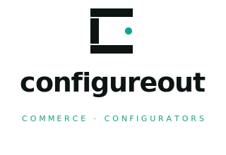

<p align="center">
  <picture>
    <source media="(prefers-color-scheme: dark)" srcset="brand/configureout-lockup-reverse.svg">
    
  </picture>
</p>
<p align="center">
  <em>Commerce · Configurators</em>
</p>

---

# Configureout — Landing Page

Static landing page for **Configureout**, the embeddable product configurator. Single `index.html` (English) + `sr/index.html` (Serbian), zero build step, deployed on Vercel.

## Brand assets
SVGs live in [`brand/`](./brand/) — primary lockup, reverse lockup, bare mark, favicon, OG card.

## Deploy on Vercel

### Option A — Vercel Dashboard
1. Go to https://vercel.com/new and import this repository.
2. Framework Preset: **Other** (no build step needed).
3. Build Command: leave empty.
4. Output Directory: leave empty (defaults to repo root).
5. Click **Deploy**.

### Option B — Vercel CLI
```bash
npm i -g vercel
vercel        # preview deploy
vercel --prod # production deploy
```

## Local preview
```bash
python3 -m http.server 8000
# then open http://localhost:8000
```

## Configuration
- `vercel.json` — clean URLs, security headers, long-lived asset caching.
- `index.html` — English landing page.
- `sr/index.html` — Serbian (Latin) landing page.
- `brand/` — logo, lockups, favicon, OG image.
